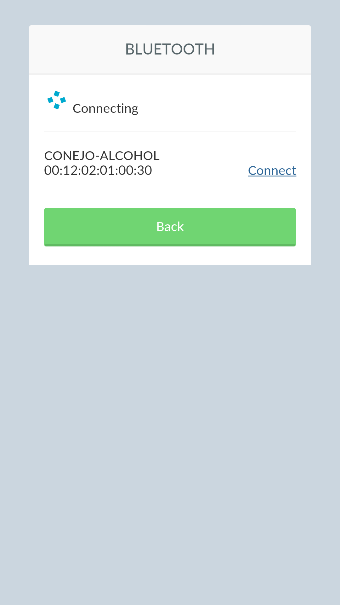

Breathalyzer on your smartphone
===

Connect a breathalyzer to your smartphone and take pictures of your drunk friends with their highscores.
This porject was around two years in the making, I started doing it in Java (the Android part) but got frustrated and left the project sitting in a box all this time. For the smartphone app I'm using phonegap/cordova, so it should work on iOS or windows phone, or at least, it should be easy to be ported. 

The idea isn't new, but all similar projects I found, didn't share the smartphone app's code, I do. It isn't the nicest app you could find, but it works.

I tried to recover all the information I wrote done when I first build this, I got most important information but some details and pictures are missing.

Bill of materials
===
* 1 Arduino nano 9-10€ , there a lot of different models and places to buy it
* 1 Grove-Alcohol sensor (seeedstudio) 5.90€ (7.90$) - http://www.seeedstudio.com/depot/Grove-Alcohol-Sensor-p-764.html
* 1 Li-po rider (seeedstudio) 7.08€ (9.50$) - http://www.seeedstudio.com/depot/Lipo-Rider-p-710.html
* 1 DSO Nano v2 replacement battery (seeedstudio) 4.10€ (5.50$) - http://www.seeedstudio.com/depot/DSO-Nano-v2-replacement-battery-p-738.html
* 1 Bluetooth module 4.80€ (6.43$) - http://www.dx.com/p/jy-mcu-arduino-bluetooth-wireless-serial-port-module-104299 (I think I bought it from ebay, and bought a pair, but is similar to this if not the same) 
* 1 Shipping from seeedstudio 2.56€ (3.44$)
* 1 3D printed case and paint 5€ (no idea, as I printed it mayself, but a small plastic case should cost much more)
* 1 switch, 2 leds, glue,.. less than 2-3€

**Aproximate cost: 40-45€**

Alcohol sensor
===

Schematics and code was taken from here : http://www.seeedstudio.com/wiki/index.php?title=Twig_-_Alcohol_Sensor
It uses the MQ303A.

Features
---

* Input Voltage: 5V
* Working Current: 120mA
* Detectable Concentration: 20-1000ppm
* Grove Compatible connector
* Highly sensitive to alcohol.
* Fast response and resumes quickly after alcohol exposure.
* Long life.
* Compact form factor.

Notes
---
To get better measurement, sensor needs to be power on for several hours before usage 

Bluetooth module
===
I use the *JY-MCU* module, very famous and cheap. You can find it in several stores (eBay, AliExpress, DX,...). I also connect one led to their *state* output. This led will pulse when not connected and switch to permanent on when connected.
 
**You need to program the BT module first**
You could use the .ino code to program your BT module. Connect RX (arduino digital pin 2) to TX (BT), and TX (arduino digital pin 3) to RX (BT), upload the code to the arduino and wait a few seconds.

Schematic
===
Handmade schematic since I didn't have the parts in Fritzing or any other schematic editor, I know it's a mess and ugly.

Mobile App
===
The mobile app is done with Phonegap/Cordova ( + angularJS), you need it in your system and this small README file will not cover its installation or general usage. To generate (in my case) the android code, just run *'phonegap build android'*, later, create the APK with your favorite method (I use Intellij IDEA). The app is really simple, it doesn't catch many errors, but **it works**. Needs work on the texts and on the style of menus, but I'm really bad at it.

*Home menu, once you're connected, a new option 'Test' will appear*

*Connecting to your BT device (alcohol sensor)*

*Blow into the sensor during 10 seconds*

*If your 'score' is higher than the lower one, you enter the hall of fame (or shame, I'm not sure)*

*Hall of fame (shame), picture, name, score and date*

Licenses
===
This is distributed under the Apache License v2.0 unless some library or code isn't compatible ):

Copyright 2014 Daniel Esteban  -  conejo@conejo.me

Licensed under the Apache License, Version 2.0 (the "License");
you may not use this file except in compliance with the License.
You may obtain a copy of the License at

    http://www.apache.org/licenses/LICENSE-2.0

Unless required by applicable law or agreed to in writing, software
distributed under the License is distributed on an "AS IS" BASIS,
WITHOUT WARRANTIES OR CONDITIONS OF ANY KIND, either express or implied.
See the License for the specific language governing permissions and
limitations under the License.